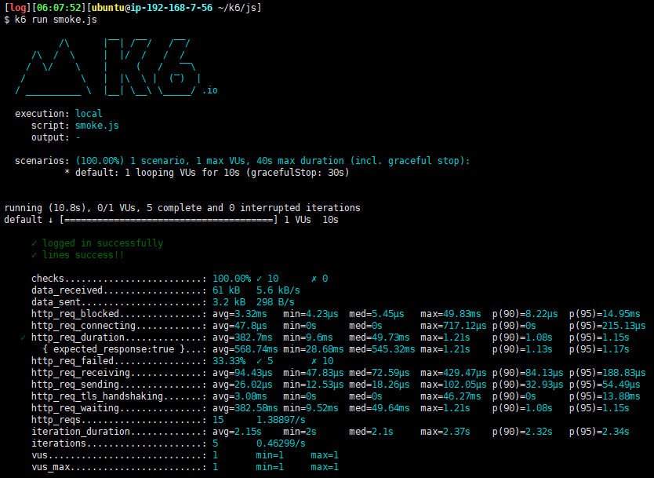
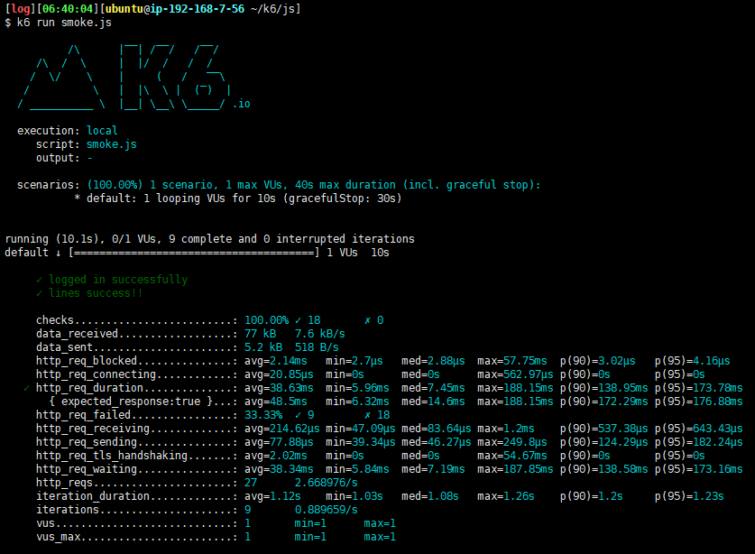
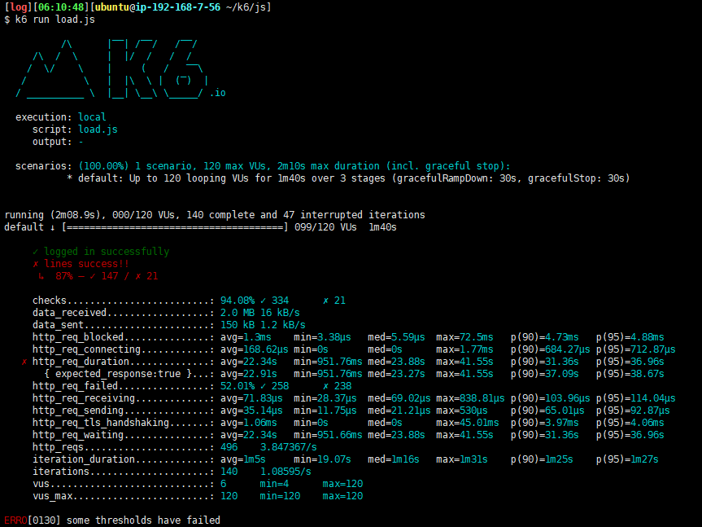
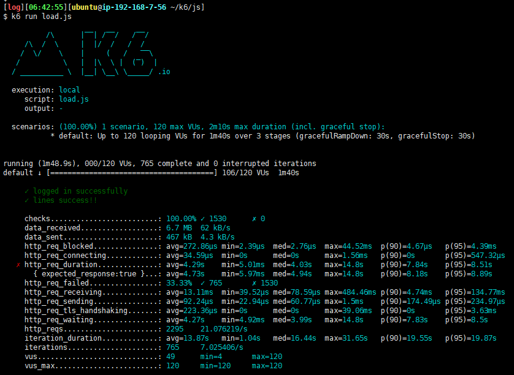
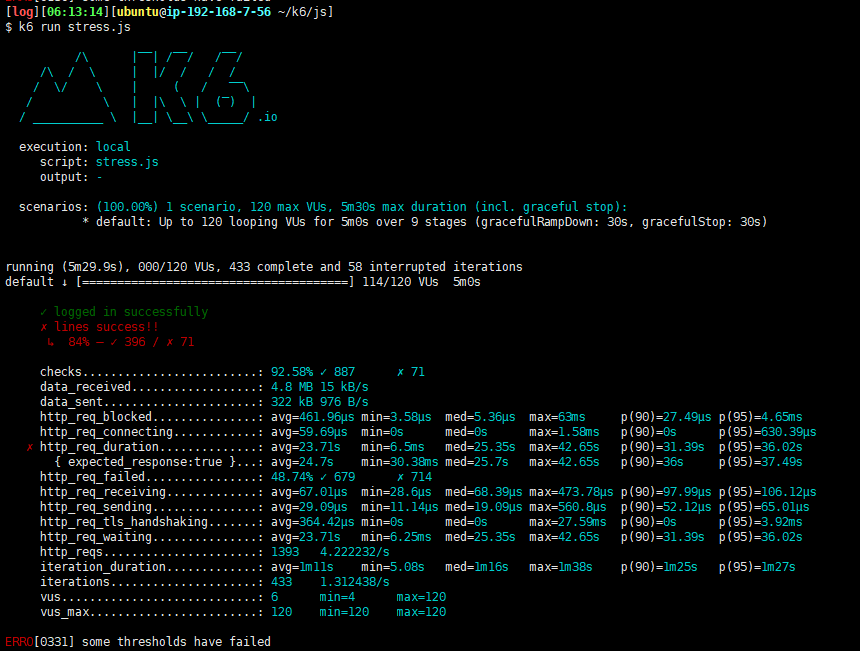
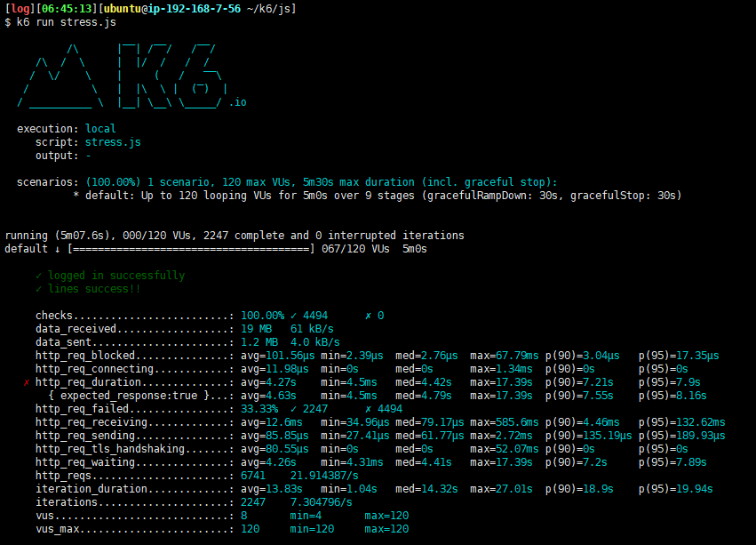

<p align="center">
    
</p>
<p align="center">
  
  
  <a href="https://edu.nextstep.camp/c/R89PYi5H" alt="nextstep atdd">
    
  </a>
  
</p>

<br>

# 인프라공방 샘플 서비스 - 지하철 노선도

<br>

## 🚀 Getting Started

### Install
#### npm 설치
```
cd frontend
npm install
```
> `frontend` 디렉토리에서 수행해야 합니다.

### Usage
#### webpack server 구동
```
npm run dev
```
#### application 구동
```
./gradlew clean build
```
<br>

## 참고
- [Pagination and Sorting using Spring Data JPA](https://www.baeldung.com/spring-data-jpa-pagination-sorting)

## 미션

* 미션 진행 후에 아래 질문의 답을 작성하여 PR을 보내주세요.

### 1단계 - 화면 응답 개선하기
1. 성능 개선 결과를 공유해주세요 (Smoke, Load, Stress 테스트 결과)
- smoke
    - before
    
    
    - after
    
- load
    - before
    
    
    - after
    
- stress
    - before
    
    
    - after
    

2. 어떤 부분을 개선해보셨나요? 과정을 설명해주세요
- 리버스 프록시 개선 : 캐시설정 & HTTP/2 설정
- WAS 성능 개선 : Redis 설정
---

### 2단계 - 조회 성능 개선하기
1. 인덱스 적용해보기 실습을 진행해본 과정을 공유해주세요
    > 공통적으로 모든 테이블의 ID는 PK 설정
    
    - [Coding as a Hobby](https://insights.stackoverflow.com/survey/2018#developer-profile-_-coding-as-a-hobby) 와 같은 결과를 반환하세요.
    ```sql
    select 
       (count(id) / (select count(id) from programmer) * 100) as 'hobby_count' 
    from programmer
    group by hobby
    ```
    > programmer.hobby에 인덱스 설정
    
    - 프로그래머별로 해당하는 병원 이름을 반환하세요.
    ```sql
    select 
       c.id, hospital.name 
    from covid as c
    inner join hospital 
       on hospital.id = c.hospital_id
    ```
    > hospital.name의 데이터 타입을 varchar(8) 로 변경하고, 유니크와 인덱스 설정
    
    - 프로그래밍이 취미인 학생 혹은 주니어(0-2년)들이 다닌 병원 이름을 반환하고 user.id 기준으로 정렬하세요.
    ```sql
    select 
       p.id, c.name
    from (
    	select id
    	from programmer
        where hobby = 'Yes' and (student like 'Yes%' or years_coding = '0-2 years')) as p
    join (
    	select covid.programmer_id, name from covid
    	join (select hospital.id, name from hospital) as h on h.id = covid.hospital_id   
    ) as c on c.programmer_id = p.id
    order by user.id
    ```
    > member.age 인덱스 설정 / programmer.country 데이터 타입을 varchar(45) 로 변경하고, 인덱스 설정
    
    - 서울대병원에 다닌 20대 India 환자들을 병원에 머문 기간별로 집계하세요.
    ```sql
    select 
       stay, count(p.member_id)
    from (select id from member where age between 20 and 29) as m
    join (select member_id from programmer where country = 'India') as p 
       on m.id = p.member_id
    join (
    	select 
 	       covid.id, covid.member_id, hospital_id, stay 
 	    from covid
        join (select id from hospital where name = '서울대병원') as h on covid.hospital_id = h.id
    ) as c 
    on m.id = c.member_id
    group by stay
    ```
    
    - 서울대병원에 다닌 30대 환자들을 운동 횟수별로 집계하세요.
    ```sql
    Select 
        exercise
        , count(p.id)
    from (select id from member where age between 30 and 39) as m
    inner join (select member_id, hospital_id, programmer_id from covid) as c
       on c.member_id = m.id
    inner join (select id, exercise from programmer) as p
       on c.programmer_id = p.id
    inner join (select id from hospital where name = '서울대병원') as h
       on c.hospital_id = h.id
    group by exercise
    ```

2. 페이징 쿼리를 적용한 API endpoint를 알려주세요
    > https://www.nextstep-hun.kro.kr/favorites?page=1
